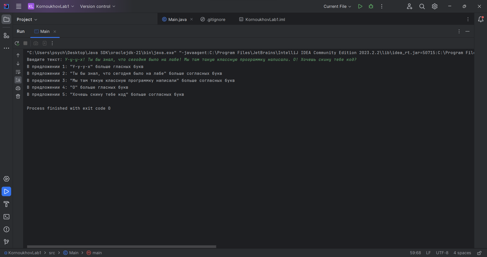

# Объектно-ориентированное программирование. ЛР1

**Вариант 10**

Найти, каких букв, гласных или согласных, больше в каждом предложении текста.

---

Выполнил Корноухов Роман, студент группы ПИН-222.

# Скриншот работы программы

